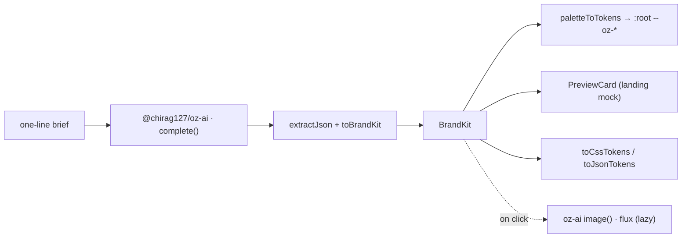

# oriz brand — AI brand-kit generator

**Live: https://brand.oriz.in**

Describe a brand in one line, get a complete identity — palette, font pairing, tagline, brand voice, and a logo-concept prompt — then the whole page **re-themes itself** to the brand it just made. Preview a mock landing card, generate a logo concept, and export design tokens as CSS or JSON.

> 100% client-side. No upload, no signup, no server. Your brief never leaves your browser.

## What it does

- **Brief → identity** — a short prompt yields a full `BrandKit` (name, tagline, voice, 5-swatch palette, heading/body font pair, logo prompt).
- **Live re-theme (signature)** — generated palette is applied to the page's `--oz-*` tokens; the studio wears the client's colors.
- **Mock landing preview** — a card that adopts the brand's palette + type so you see it in context.
- **WCAG check** — each swatch shows its contrast grade on white (AAA / AA / AA Large / Fail).
- **Logo concept** — optional, lazy-loaded flux image via `@chirag127/oz-ai` (keyless, multi-provider failover). Copy-ready prompt for any image model.
- **Export** — one-click `*-tokens.css` (`:root` custom props) and `*-tokens.json` (design-token JSON).

AI is the core here, but it degrades gracefully: if every provider is down you get a clear error and the UI stays intact.

## Architecture



## Stack

- **Astro 6** static output, **React 19** islands (only the studio is interactive).
- **Tailwind v4** via `@tailwindcss/vite`; bespoke `--oz-*` token theme.
- Shared atomic packages — one source of truth, themed per site:
  - `@chirag127/oz-ai` — all AI (g4f/gpt4free, multi-provider failover, no key).
  - `@chirag127/oz-file` — `downloadBlob` for token export.
  - `@chirag127/oz-tokens-base` — the `--oz-*` contract, overridden with this site's palette.
  - `@chirag127/oz-chrome` — `oriz.in` wordmark + header/footer/tool-shell.
- Pure domain logic in `src/lib/brand.ts` (parsing, WCAG, token export) — unit-tested with vitest.

## Develop

Windows: use **npm**, not pnpm (pnpm skips `@esbuild/win32-x64`).

```bash
npm install --legacy-peer-deps
npm run dev       # local
npm test          # vitest — pure logic
npm run build     # static dist/
npm run deploy    # build + wrangler pages deploy (project: oriz-brand)
```

## Privacy

Everything runs in your browser. The brief is sent only to keyless AI providers to generate the kit; nothing is stored, logged, or uploaded to any oriz server. No cookies, no analytics, no accounts.

## License

MIT © 2026 Chirag Singhal
