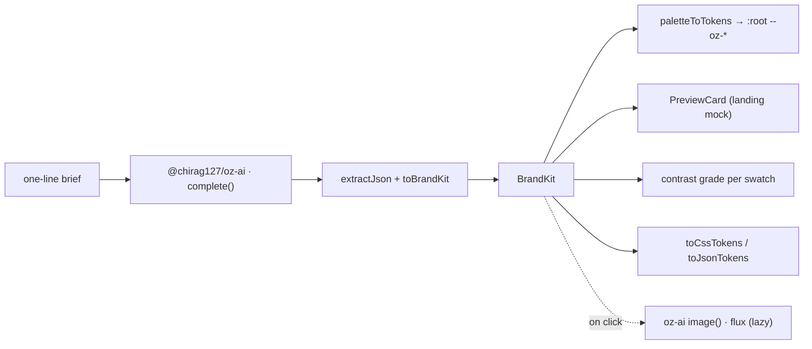

# oriz Brand — AI brand-kit generator

> Describe a brand in one line, get a complete identity — palette, font pairing, tagline, voice, and a logo-concept prompt — then watch the whole page re-theme itself to the brand it just made.

[](./LICENSE)
[](https://github.com/chirag127/oriz-palette-ai/stargazers)
[](https://github.com/chirag127/oriz-palette-ai/commits/main)
[](https://github.com/chirag127/oriz-palette-ai/actions/workflows/deploy.yml)
[](https://astro.build)

## What it is / why it exists

Naming a brand is easy; giving it a coherent visual identity is the slow part. `oriz Brand` turns a one-line brief into a full `BrandKit` — name, tagline, brand voice, a 5-swatch palette, a heading/body font pairing, and a copy-ready logo-concept prompt — then applies that palette to the page's own `--oz-*` tokens so the studio literally wears the client's colours. It is 100% client-side: the brief is sent only to keyless AI providers to generate the kit, and nothing is stored, logged, or uploaded to any oriz server.

## Links

- **Live app:** https://brand.oriz.in
- **About / info page:** https://chirag127.github.io/oriz-palette-ai/ (published from `gh-info/` via `.github/workflows/gh-pages-info.yml`)
- **llms.txt:** https://brand.oriz.in/llms.txt · https://brand.oriz.in/llms-full.txt
- **Repo:** https://github.com/chirag127/oriz-palette-ai

⭐ If this is useful, please **star the repo** — it helps others find it.

## How it works



## Features

- **Brief → identity** — a short prompt yields a full `BrandKit` (name, tagline, voice, 5-swatch palette, heading/body font pair, logo prompt).
- **Live re-theme (signature)** — the generated palette is applied to the page's `--oz-*` tokens; the studio re-themes to the brand it just made.
- **Mock landing preview** — a card that adopts the brand's palette + type so you see the identity in context.
- **WCAG contrast check** — each swatch shows its contrast grade on white (AAA / AA / AA Large / Fail).
- **Logo concept** — optional, lazy-loaded flux image via `@chirag127/oz-ai` (keyless, multi-provider failover); the prompt is copy-ready for any image model.
- **Export** — one-click `*-tokens.css` (`:root` custom props) and `*-tokens.json` (design-token JSON).
- **Graceful degradation** — if every AI provider is down you get a clear error and the UI stays intact.

## Tech stack

- **Astro 6** static output, **React 19** islands (only the studio is interactive).
- **Tailwind v4** via `@tailwindcss/vite`; a bespoke `--oz-*` token theme.
- **@vite-pwa/astro** — installable PWA (package id `in.oriz.brand`; see `PWABUILDER.md`).
- `@fontsource-variable/archivo` + `@fontsource-variable/space-grotesk`.
- Shared atomic `@chirag127/*` packages — one source of truth, themed per site:
  - `@chirag127/oz-ai` — all AI (g4f/gpt4free, multi-provider failover, no key).
  - `@chirag127/oz-file` — `downloadBlob` for token export.
  - `@chirag127/oz-tokens-base` — the `--oz-*` contract, overridden with this site's palette.
  - `@chirag127/oz-chrome` — `oriz.in` wordmark + header/footer/tool-shell.
- Pure domain logic in `src/lib/brand.ts` (parsing, WCAG, token export), unit-tested with **vitest**.

## Repo structure

```
src/
  components/
    Studio.tsx        # the interactive brief → kit studio (React island)
    PreviewCard.tsx   # landing mock that adopts the generated brand
  layouts/Layout.astro
  lib/brand.ts        # parsing, WCAG contrast, token export (pure, tested)
  pages/index.astro
  styles/{studio,theme}.css
tests/brand.test.ts   # vitest unit tests for lib/brand.ts
gh-info/index.html    # the GitHub Pages info page
astro.config.mjs      # site, PWA manifest, runtime caching
PWABUILDER.md         # store-packaging notes (Android/Windows)
```

## Quick start

Windows: use **npm**, not pnpm (pnpm skips `@esbuild/win32-x64`).

```bash
npm install --legacy-peer-deps
npm run dev       # local dev server
npm test          # vitest — pure logic
npm run build     # static dist/
npm run preview   # preview the build
npm run deploy    # build + wrangler pages deploy (project: oriz-palette-ai)
```

## Configuration

**No configuration required.** No API keys, cookies, analytics, or accounts. The brief is sent only to keyless AI providers via `@chirag127/oz-ai`; nothing is persisted server-side.

## Screenshots

_Placeholder — add desktop + mobile captures of the studio re-theming to a generated brand._

## Part of the oriz family

One of ~80 sites in the **oriz** family. See how the fleet is built at [blog.oriz.in](https://blog.oriz.in).

- **Cost:** $0 on the Cloudflare free tier.

## Security

No secrets in the repo; the fleet uses a sops + age vault, and only `PUBLIC_*` client keys ever ship to the browser. This app needs none.

## Contributing

Issues and PRs welcome — keep them terse and focused. Conventional commits, `main`-only.

## Status / roadmap

Stable and live at brand.oriz.in. Incremental polish; no breaking changes planned.

## Changelog

Conventional commits are the changelog.

## License

MIT © 2026 Chirag Singhal — see [LICENSE](./LICENSE).

## Author

Chirag Singhal · chirag@oriz.in
